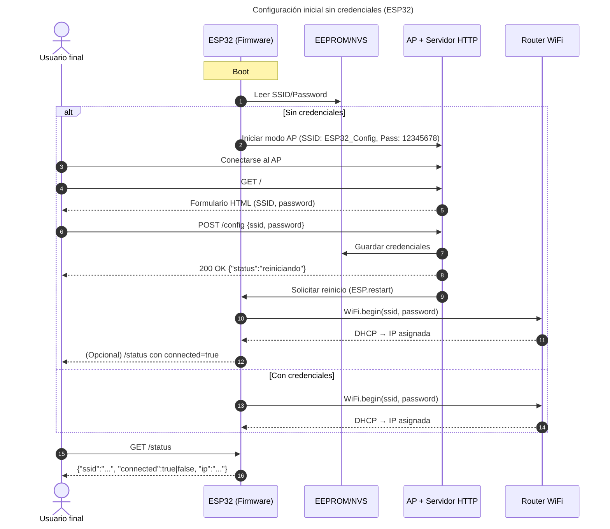
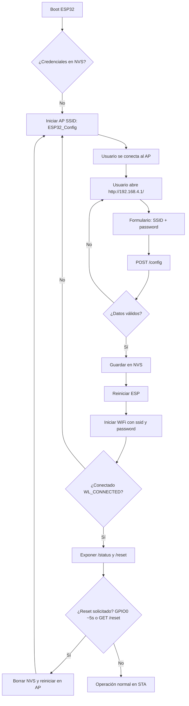

# Aprovisonamiento de red Wifi Con Esp32

## Descripción del Proyecto
Configuración Dinámica de WiFi en ESP32 con Portal Web Local
Descripción del Proyecto

Este proyecto demuestra cómo un ESP32 permite configurar la red WiFi sin reprogramar el dispositivo, usando una interfaz web local servida en modo AP y persistiendo credenciales en memoria no volátil (EEPROM/NVS). El firmware conmuta entre AP/STA según la disponibilidad de credenciales y expone endpoints HTTP para estado, configuración y restablecimiento.

En primer arranque (o sin credenciales), el ESP32 inicia en modo AP, publica un formulario para ingresar SSID y password y guarda en memoria no volátil.

Tras guardar, reinicia y se conecta en modo STA; si hay error/timeout, retorna a AP para reconfiguración.

Existen endpoints REST: /status, /config y /reset, además de un botón físico (GPIO) para borrar credenciales.


## Funcionamiento Video 
https://youtu.be/_P0HO1wJ0PQ?si=Xp6m__N9iCVR4Ddc

## Dependencias Principales

En el entorno Arduino/PlatformIO se requieren las siguientes librerías y plataformas (referencia conceptual en formato XML para mantener la sintaxis):

```xml
<dependency>
  <name>ESP32 Arduino Core</name>
  <source>Board Manager / PlatformIO platform = espressif32</source>
</dependency>
<dependency>
  <name>WiFi</name>
  <artifactId>WiFi.h (incluida en el Core ESP32)</artifactId>
</dependency>
<dependency>
  <name>WebServer</name>
  <artifactId>WebServer.h (incluida en el Core ESP32)</artifactId>
</dependency>
<dependency>
  <name>EEPROM</name>
  <artifactId>EEPROM.h (incluida en el Core ESP32)</artifactId>
</dependency>
<dependency>
  <name>Preferences (alternativa)</name>
  <artifactId>Preferences.h (NVS, opcional)</artifactId>
</dependency>

```

---

## Configuración de Red

Configuración del Dispositivo y Red

Parámetros por defecto del firmware (referenciados conceptualmente con sintaxis de properties):

```properties
# Punto de acceso para configuración inicial
ap.ssid=ESP32_Config
ap.password=12345678
ap.ip=192.168.4.1

# Tiempo máximo de espera para conexión STA (ms)
sta.connect.timeout=15000

# GPIO para reset de credenciales (mantener ~5 s)
reset.gpio=0
reset.hold.ms=5000

# Persistencia
storage.mode=EEPROM   # opciones: EEPROM | NVS | SPIFFS

```
El portal de configuración está disponible en http://192.168.4.1/ cuando el dispositivo está en modo AP.
---

## Endpoints HTTP


## Diagrama de Arquitectura


---

Endpoints HTTP

GET /status
Devuelve estado de conexión y SSID actual.
Ejemplo (modo AP): curl http://192.168.4.1/status

Ejemplo (modo STA): curl http://<ip_asignada_por_router>/status

POST /config
Guarda credenciales (SSID y password) y reinicia el dispositivo. Acepta application/x-www-form-urlencoded o application/json.
Ejemplo URL-encoded: curl -X POST http://192.168.4.1/config
 -d "ssid=MiRed&password=Secreta123"
Ejemplo JSON: curl -X POST http://192.168.4.1/config
 -H "Content-Type: application/json" -d '{"ssid":"MiRed","password":"Secreta123"}'

GET /reset
Borra credenciales almacenadas y reinicia en modo AP.
Ejemplo: curl http://192.168.4.1/reset

Base URL sugerida para Postman

Modo AP: http://192.168.4.1

Modo STA: http://<ip_asignada_por_router>

Diagrama de Arquitectura

[Inserta aquí la imagen del diagrama, por ejemplo: diagrams/architecture_esp32_wifi.png]

## Explicación de la Implementación

main.ino
Lógica principal del firmware: lectura/escritura de credenciales, conmutación entre AP/STA, arranque de servidor HTTP, endpoints y manejo del botón de reset.

Servidor HTTP embebido
Rutas:
• GET / → página de formulario de configuración (HTML embebido o servido desde SPIFFS/LittleFS)
• POST /config → guarda ssid/password en EEPROM/NVS y reinicia
• GET /status → JSON con {ssid, connected}
• GET /reset → borra credenciales y reinicia en AP

Persistencia (EEPROM o NVS/Preferences)
Almacena de forma no volátil el SSID y la contraseña. Alternativa: SPIFFS/LittleFS si se requieren archivos.

Gestor de WiFi (FSM)
Estados: BOOT → CHECK_CREDENTIALS → (AP_MODE | CONNECTING) → CONNECTED.
Transiciones por timeout de conexión, error de autenticación o petición de reset.

Reset de credenciales (GPIO)
Botón en GPIO0 con INPUT_PULLUP. Mantener presionado aprox. 5 s para borrar credenciales y volver a AP.

## Validación y Pruebas

Arranque sin credenciales: verificar SSID ESP32_Config, acceso a http://192.168.4.1
, guardar y reiniciar.

Conexión STA correcta: obtener IP por DHCP y comprobar GET /status con connected=true.

Error/timeout: introducir credenciales inválidas y confirmar retorno a AP para reconfigurar.

Reset: probar botón GPIO0 (~5 s) y GET /reset, verificar regreso a AP.

Endpoints: probar con Postman o curl los tres endpoints en AP y en STA.

Buenas Prácticas

Separación de responsabilidades: WiFi (STA/AP), servidor HTTP, persistencia, GPIO.

Manejo de timeouts y fallback automático a AP en caso de fallo de conexión.

Código comentado y valores por defecto claros (SSID AP, password, timeout).

FSM documentada en diagramas para facilitar mantenimiento y pruebas.

## Seguridad y Consideraciones

En este prototipo la contraseña se guarda en claro para simplicidad académica. Para producción:
• Preferir NVS/Preferences y/o cifrado/obfuscación en reposo.
• Cambiar la contraseña del AP de fábrica y limitar la ventana de configuración.
• Considerar portal cautivo real (redirección automática) si se requiere.
• Añadir OTA, logs y métricas si el despliegue lo exige.

## Diagramas (placeholders)

# Diagramas del Proyecto

## Secuencia: configuración inicial (sin credenciales)

# Actividad (flujo de configuración web): diagrams/activity_config.md



## Contribuciones
Este proyecto fue desarrollado por:
- Nicolas Rodriguez
- Juan Diego Martinez
- Camilo Otalora
